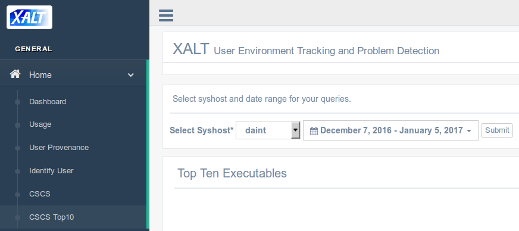
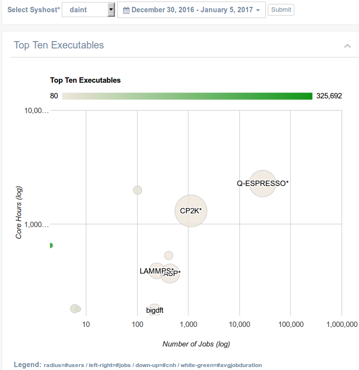
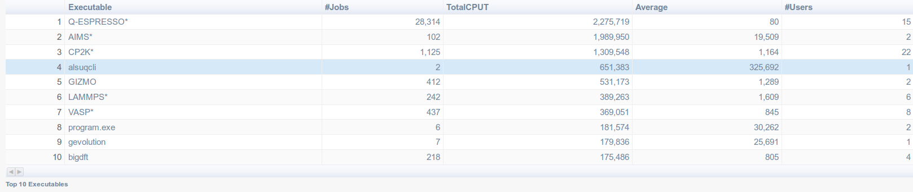
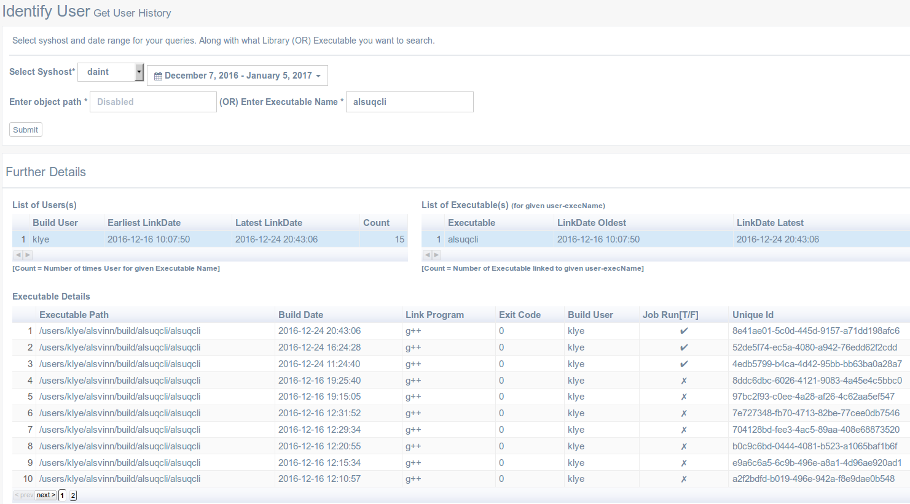
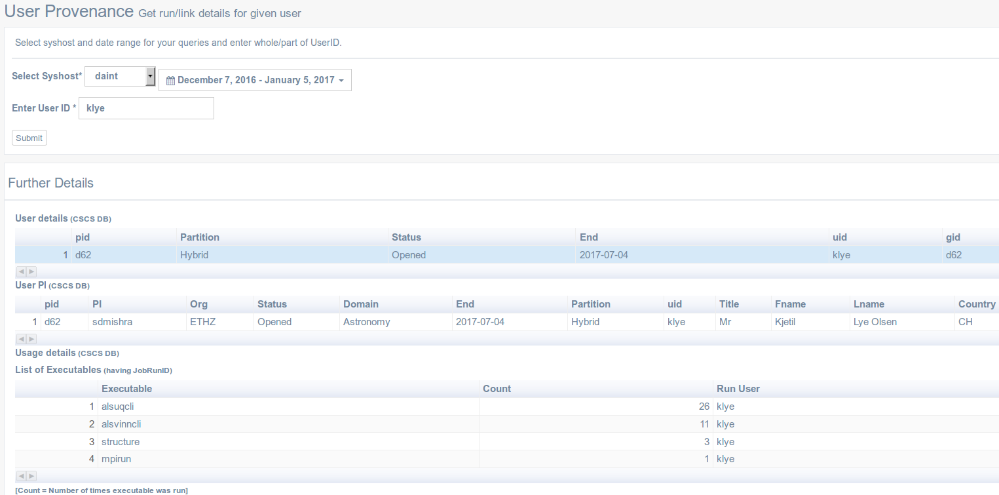
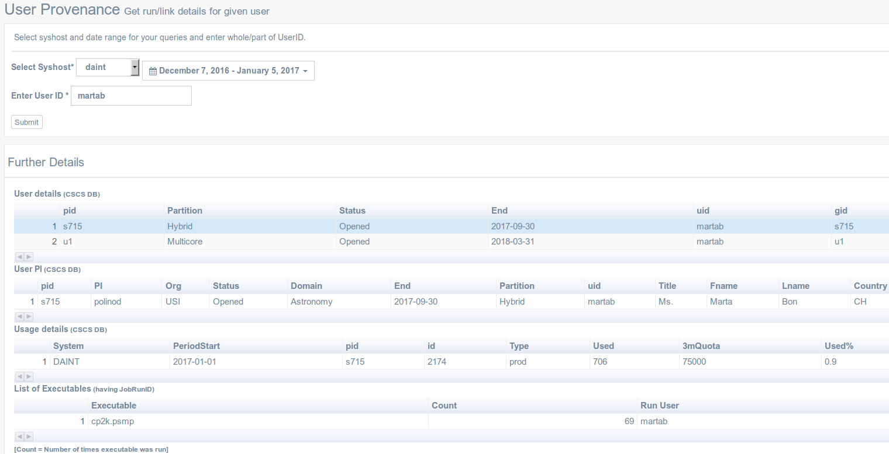

## XALT: Getting details for a given executable

* Go to [http://tpc14.cscs.ch/xalt-portal.git/xalt_dashboard_cscs.html](http://tpc14.cscs.ch/xalt-portal.git/xalt_dashboard_cscs.html)
and choose dates.

---
### Top 10 Executables (Bubble chart and data table)

* Clicking on the submit button will show the Top 10 Executables:

---
* Same data inside a table: 

---
### Finding users running a given executable 

* To find who used a given executable (`alsuqcli` for instance), go to [http://tpc14.cscs.ch/xalt-portal.git/xalt_identify.html](http://tpc14.cscs.ch/xalt-portal.git/xalt_identify.html) and enter the executable name:

---
## Getting details for a given User ID (CSCS DB)

* Go to [http://tpc14.cscs.ch/xalt-portal.git/xaltindex.html](http://tpc14.cscs.ch/xalt-portal.git/xaltindex.html)
and enter a `UserID` (syshost and dates are ignored). The result for user `klye` is:

---
### Multiple Groups
* It also works for user having more than 1 gid:

---
### Project details
* Selecting one of the row in the first table will display more details for the
selected project id
    * for instance for project `s715`:

    * and for project `u1`:

---
### Troubleshooting
* If a user did not use its allocation, then a table may be empty:

    * as confirmed by `sbucheck`:

