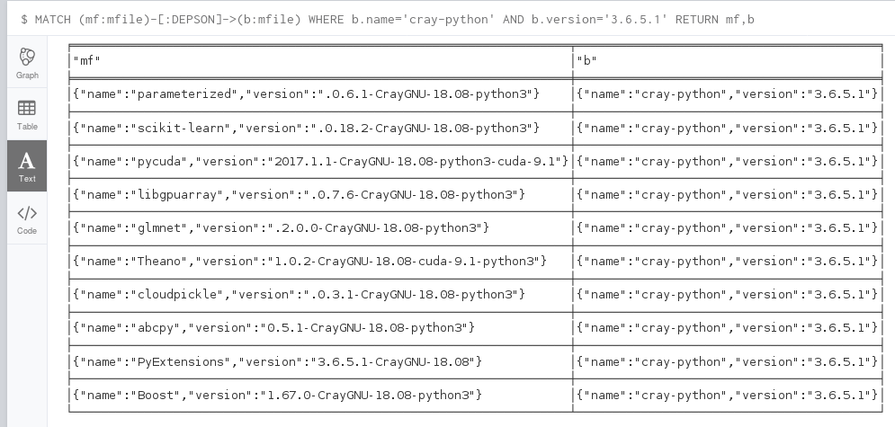
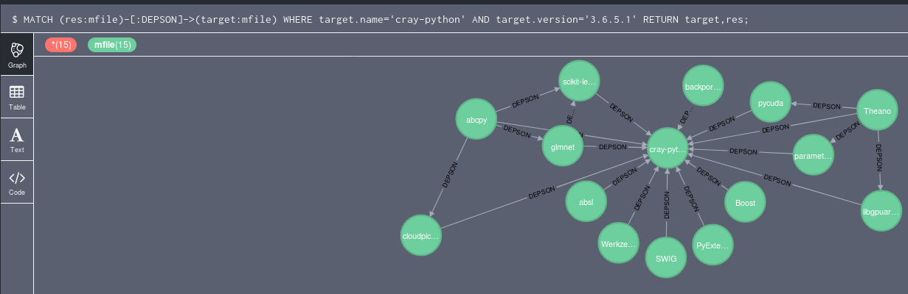

# Easybuild dependencies 

`mf.sh` is a utility script to find dependencies between .ebs.
This script relies on [neo4j](https://neo4j.com/) + [java] and is not bug free.

## Generate the list of dependencies

* The script must be run as follows:

```
cd jenkins-builds/tools/
./mf.sh gpu    # or ./mf.sh mc
```

* It will take `6.0.UP07-18.08-gpu` (or -mc) as input and generate a
list of dependencies in neo4j format. 

## Query the database

The output of mf.sh can be used with the `cypher-shell` neo4j command to generate reports. A typical output can be found in the `mf.sh.neo4j` file. More details in https://madra.cscs.ch/scs/doc/issues/156

## Example

To get the list of modulefiles that depends on `cray-python/3.6.5.1`, add a MATCH line at the end of `mf.sh.neo4j`:


```
...
CREATE (scikitlearn0182CrayGNU1808python3)-[:DEPSON]->(craypython3651)
CREATE (zlib1211CrayGNU1808)-[:DEPSON]->(CrayGNU1808);
MATCH (res:mfile)-[:DEPSON]->(target:mfile) WHERE target.name='cray-python' AND target.version='3.6.5.1' RETURN target,res;
```

and run with:

```
cat mf.sh.neo4j | ./cypher-shell -uneo4j
```

### example text report



### example interactive report



