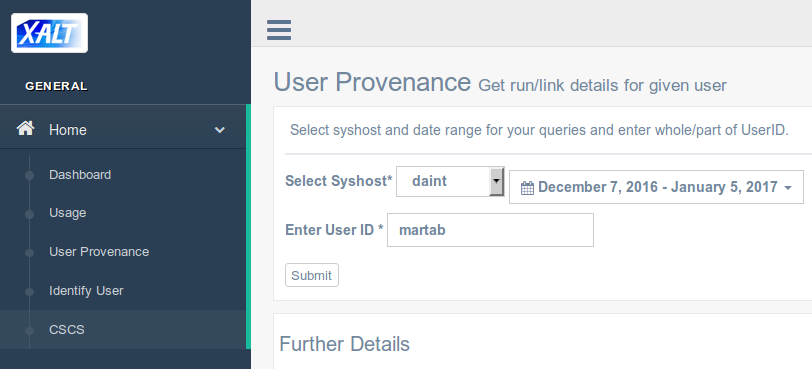

## XALT: Getting details for a given User ID (CSCS DB)

* Go to [http://tpc14.cscs.ch/xalt-portal.git/xaltindex.html](http://tpc14.cscs.ch/xalt-portal.git/xaltindex.html)
and enter a `UserID` (syshost and dates are ignored) 

---
### Groups and Executables
* Clicking on the submit button will show the list of `groups` for the given userid
plus the list of `executables` run by the same userid on Daint:

---
### Project details
* Selecting one of the row in the first table will display more details for the
selected project id
    * for instance for project `s715`:

    * and for project `u1`:

---
### Troubleshooting
* If a user did not use its allocation, then a table may be empty:

    * as confirmed by `sbucheck`:

